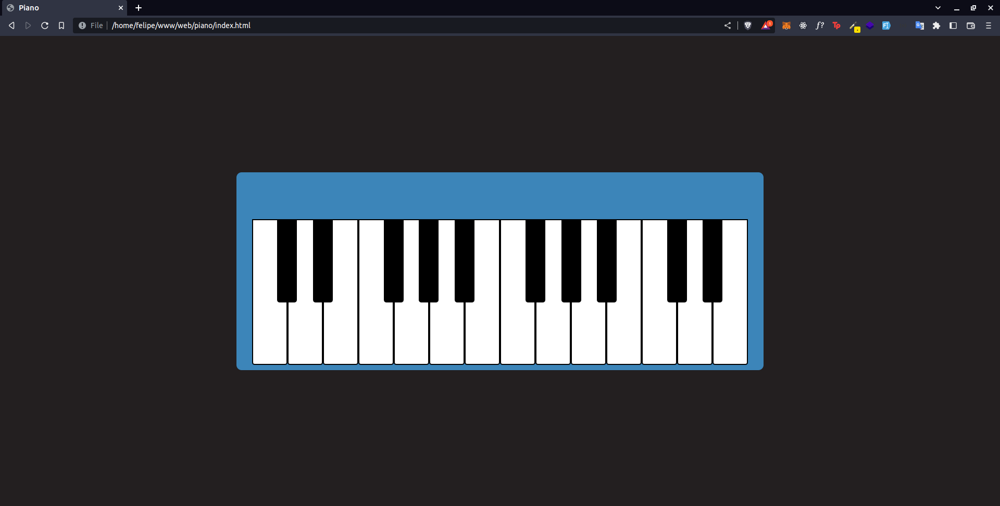

# Piano in JavaScript 🎹

# About
An amazing piano with only HTML, CSS and JavaScript and sounds from MP3 files.

# Installation

```bash
gh repo git@github.com:felipecepluki/piano.git
```
then copy path of HTML file and paste in your favorite Browser

# Technologies

  
 